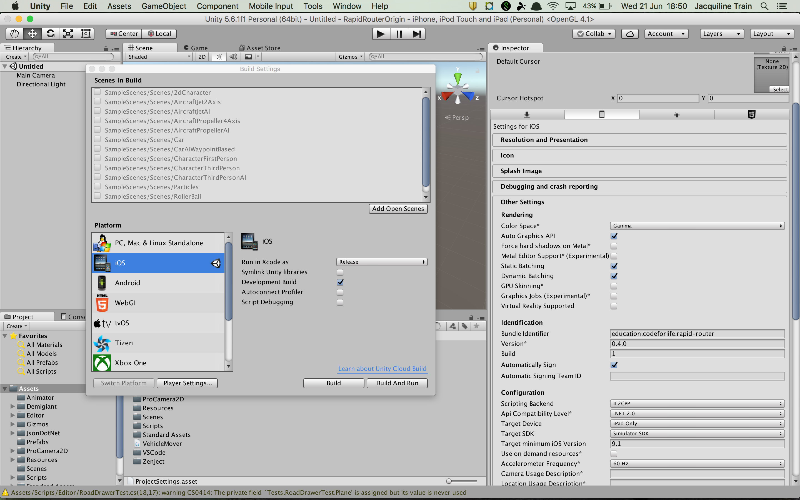
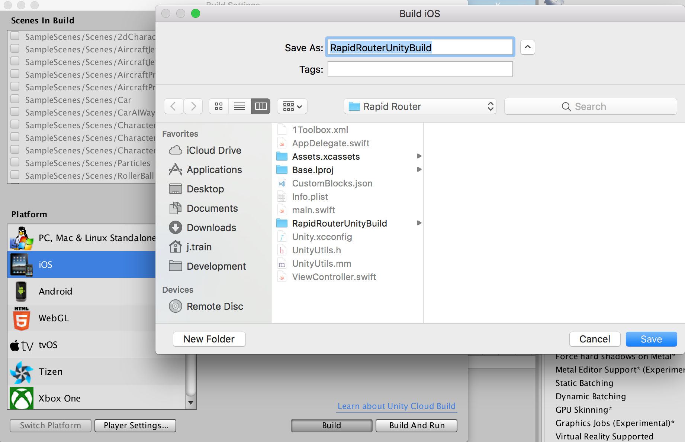
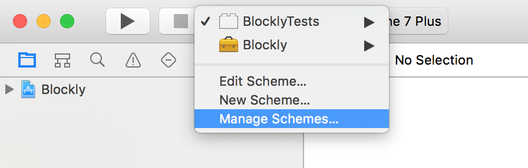
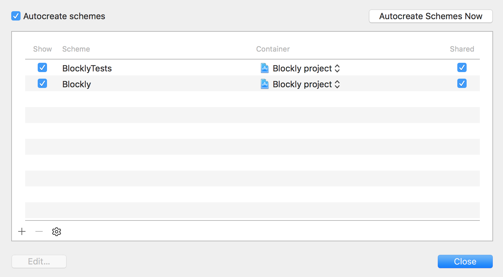

# Contributor Development Guide

## Prerequisites:
1. Clone [RapidRouter iOS Project](https://github.com/ocadotechnology/rapid-router-ios)
2. Clone [RapidRouter Unity Project](https://github.com/ocadotechnology/rapid-router-unity)
3. Install [Carthage](https://github.com/Carthage/Carthage#installing-carthage)

## Build Unity
1. Switch to iOS platform
2. Select Release for Xcode run type
3. Click Development Build checkbox
4. Choose Player Settings… -> Device
    - Select Other Settings
        - Change “Colour Space*” to “Gamma”
        - Tick “Auto Graphics API”
        - Change Target SDK from Device SDK to Simulator SDK
        
 

5. Build project
    - Select to save at root/RapidRouter of iOS project, with name RapidRouterUnityBuild
    
 

## Build Xcode Project
1. Ensure Unity folder folder is properly linked to RapidRouter/RapidRouterUnityBuild
2. Remove all .h files from Unity/Classes/Native
3. Go to Unity/Classes/main.mm and rename the `main` method to `unity_main`
4. Copy method from UnityBridge.h and replace the getAppController method in `UnityAppController.h`
5. Open terminal at root of project and run `carthage update`

6. Open rapid-router-ios/Carthage/Checkouts/blockly-ios/Blockly.xcodeproj
- Select Manage Schemes
    
 

- Only BlocklyTests will have `Shared` enabled. Tick `Shared` for the Blockly framework as well and click `Done`
    
 

    
 

7. Finally, at the root of the iOS project, run `carthage build`
